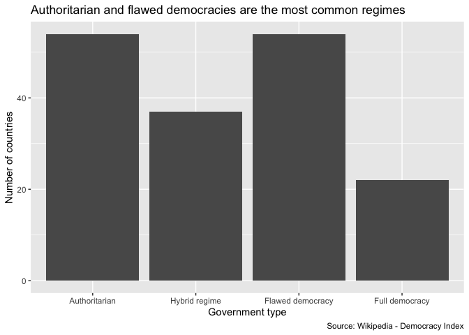
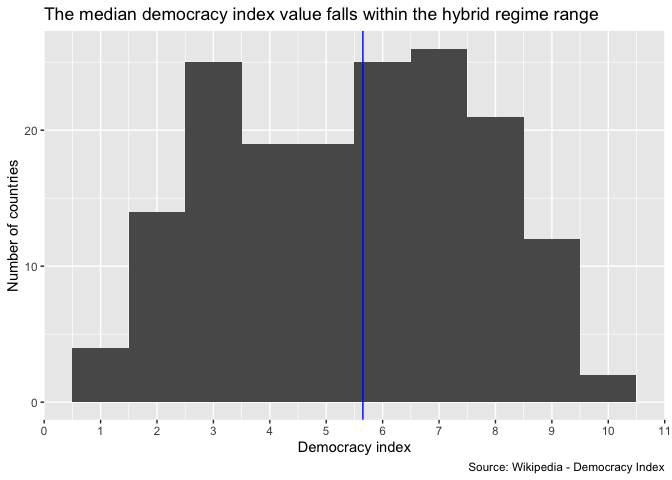
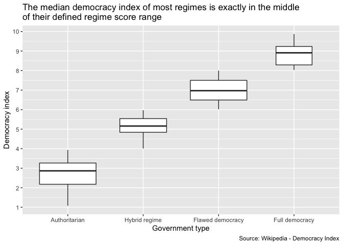
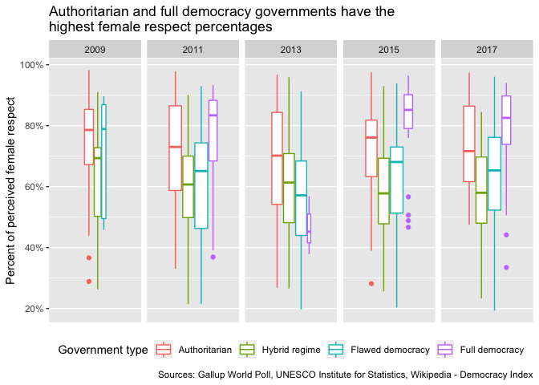
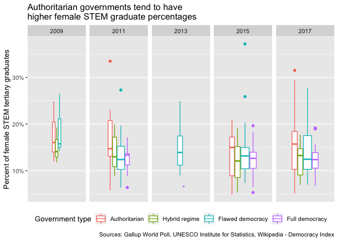
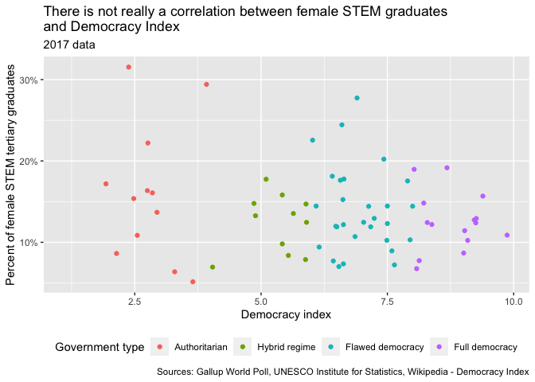
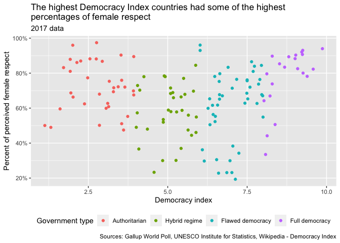
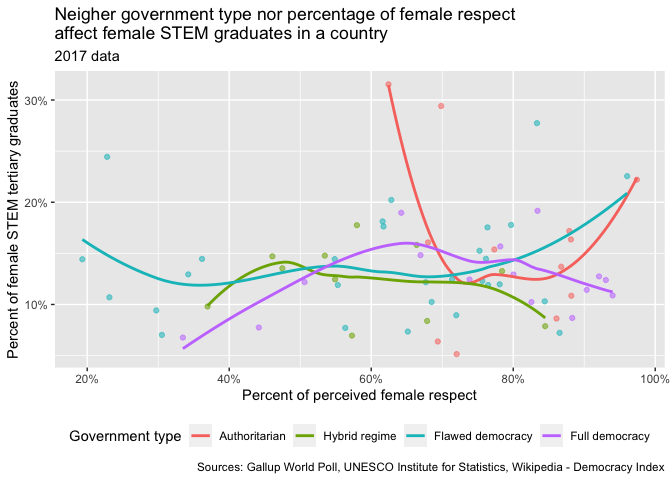

Female respect, female STEM tertiary graduates, and government types
================
Sara Berg-Love
2020-03-14

  - [Summary](#summary)
  - [1D EDA - Government regimes](#1d-eda---government-regimes)
  - [Effect of democracy on female respect and STEM
    graduates](#effect-of-democracy-on-female-respect-and-stem-graduates)
  - [References](#references)

``` r
# Libraries
library(tidyverse)

# Parameters
file_data_governments <- here::here("data/governments.rds")

file_data <- here::here("data/respect_stem_governments.rds")

#===============================================================================

governments <- read_rds(file_data_governments)
respect_stem_governments <- read_rds(file_data)
```

Combining the data from the UNESCO Institute of Statistics on female
tertiary STEM graduates, the Gallup World Poll on female respect, and
Wikipedia on the Democracy Index and government types of countries
around the world \[1\]\[2\]\[3\]. The Democracy Index is created by the
Economist Intelligence Unit and measures the range of democracy in 166
countries. The scale is from 0-10, broken down like this:

  - 0-4: Authoritarian government
  - 4-6: Hybrid regime government
  - 6-8: Flawed democracy
  - 8-10: Full democracy

## Summary

``` r
summary(governments)
```

    ##      rank             country              score                    regime  
    ##  Length:167         Length:167         Min.   :1.080   Authoritarian   :54  
    ##  Class :character   Class :character   1st Qu.:3.370   Hybrid regime   :37  
    ##  Mode  :character   Mode  :character   Median :5.650   Flawed democracy:54  
    ##                                        Mean   :5.440   Full democracy  :22  
    ##                                        3rd Qu.:7.165                        
    ##                                        Max.   :9.870

``` r
summary(respect_stem_governments)
```

    ##    country               year      perct_women_stem_grad    region         
    ##  Length:3824        Min.   :1998   Min.   : 0.5714       Length:3824       
    ##  Class :character   1st Qu.:2011   1st Qu.: 9.5287       Class :character  
    ##  Mode  :character   Median :2013   Median :12.7126       Mode  :character  
    ##                     Mean   :2012   Mean   :13.3725                         
    ##                     3rd Qu.:2015   3rd Qu.:15.7931                         
    ##                     Max.   :2019   Max.   :60.0000                         
    ##                     NA's   :9      NA's   :1965                            
    ##    region_2          prop_type              prop            rank          
    ##  Length:3824        Length:3824        Min.   :0.1169   Length:3824       
    ##  Class :character   Class :character   1st Qu.:0.5231   Class :character  
    ##  Mode  :character   Mode  :character   Median :0.6715   Mode  :character  
    ##                                        Mean   :0.6513                     
    ##                                        3rd Qu.:0.7963                     
    ##                                        Max.   :0.9943                     
    ##                                        NA's   :785                        
    ##      score                    regime    
    ##  Min.   :1.080   Authoritarian   : 990  
    ##  1st Qu.:3.740   Hybrid regime   : 855  
    ##  Median :5.880   Flawed democracy:1178  
    ##  Mean   :5.629   Full democracy  : 515  
    ##  3rd Qu.:7.490   NA's            : 286  
    ##  Max.   :9.870                          
    ##  NA's   :286

## 1D EDA - Government regimes

``` r
governments %>% 
  ggplot((aes(regime))) +
  geom_bar(na.rm = TRUE) +
  labs(
    title = "Authoritarian and flawed democracies are the most common regimes",
    x = "Government type",
    y = "Number of countries",
    caption = "Source: Wikipedia - Democracy Index"
  )
```

<!-- -->

``` r
governments %>% 
  ggplot((aes(score))) +
  geom_histogram(binwidth = 1, na.rm = TRUE) +
  geom_vline(aes(xintercept = median(score)), color = "blue") +
  scale_x_continuous(breaks = scales::breaks_width(1)) +
  labs(
    title = 
      "The median democracy index value falls within the hybrid regime range",
    x = "Democracy index",
    y = "Number of countries",
    caption = "Source: Wikipedia - Democracy Index"
  )
```

<!-- -->

``` r
governments %>% 
  ggplot(aes(regime, score)) +
  geom_boxplot(varwidth = TRUE) +
  scale_y_continuous(breaks = scales::breaks_width(1)) +
  labs(
    title = 
      "The median democracy index of most regimes is exactly in the middle\nof their defined regime score range",
    x = "Government type",
    y = "Democracy index",
    caption = "Source: Wikipedia - Democracy Index"
  )
```

<!-- -->

## Effect of democracy on female respect and STEM graduates

``` r
respect_stem_governments %>%
  filter(prop_type == "All", year %in% seq(2009, 2017, 2)) %>% 
  drop_na(regime) %>% 
  ggplot(aes(x = factor(1), y = prop)) +
  geom_boxplot(aes(color = regime), varwidth = TRUE) +
  facet_grid(cols = vars(year)) +
  scale_x_discrete(breaks = NULL) +
  scale_y_continuous(labels = scales::percent_format(accuracy = 1)) +
  theme(legend.position = "bottom") +
  labs(
    title = 
      "Authoritarian and full democracy governments have the\nhighest female respect percentages",
    x = NULL,
    y = "Percent of perceived female respect",
    color = "Government type",
    caption = 
      "Sources: Gallup World Poll, UNESCO Institute for Statistics, Wikipedia - Democracy Index"
  )
```

<!-- -->

``` r
respect_stem_governments %>%
  filter(prop_type == "All", year %in% seq(2009, 2017, 2)) %>% 
  drop_na(regime) %>% 
  ggplot(aes(x = factor(1), y = perct_women_stem_grad)) +
  geom_boxplot(aes(color = regime), varwidth = TRUE) +
  facet_grid(cols = vars(year)) +
  scale_x_discrete(breaks = NULL) +
  scale_y_continuous(labels = scales::percent_format(accuracy = 1, scale = 1)) +
  theme(legend.position = "bottom") +
  labs(
    title = 
      "Authoritarian governments tend to have\nhigher female STEM graduate percentages",
    x = NULL,
    y = "Percent of female STEM tertiary graduates",
    color = "Government type",
    caption = 
      "Sources: Gallup World Poll, UNESCO Institute for Statistics, Wikipedia - Democracy Index")
```

    ## Warning: Removed 344 rows containing non-finite values (stat_boxplot).

<!-- -->

Government type seems to have a greater effect on percentage of
perceived female respect. Authoritarian governments and full democracies
tend to have the highest female respect percentages, followed by flawed
democracies, then hybrid regimes. Overall, the median percentages of
respect have stayed constant for authoritarian regimes, slightly
decreased for full democracies, increased for flawed democracies, and
cycled up and down for hybrid regimes. The type of government has less
of an impact on percentages of women in STEM fields, with authoritarian
governments having slightly higher percentages more recently, and the
rest of the governments being about the same.

``` r
respect_stem_governments %>%
  filter(prop_type == "All", year == 2017) %>% 
  drop_na(regime) %>% 
  ggplot((aes(score, perct_women_stem_grad, color = regime))) +
  geom_point() +
  scale_y_continuous(labels = scales::percent_format(accuracy = 1, scale = 1)) +
  theme(legend.position = "bottom") +
  labs(
    title = 
      "There is not really a correlation between female STEM graduates\nand Democracy Index",
    subtitle = "2017 data",
    x = "Democracy index",
    y = "Percent of female STEM tertiary graduates",
    color = "Government type",
    caption = 
      "Sources: Gallup World Poll, UNESCO Institute for Statistics, Wikipedia - Democracy Index"
    )
```

    ## Warning: Removed 67 rows containing missing values (geom_point).

<!-- -->

``` r
respect_stem_governments %>%
  filter(prop_type == "All", year == 2017) %>% 
  drop_na(regime) %>% 
  ggplot((aes(score, prop, color = regime))) +
  geom_point() +
  scale_y_continuous(labels = scales::percent_format(accuracy = 1)) +
  theme(legend.position = "bottom") +
  labs(
    title = 
      "The highest Democracy Index countries had some of the highest\npercentages of female respect",
    subtitle = "2017 data",
    x = "Democracy index",
    y = "Percent of perceived female respect",
    color = "Government type",
    caption = 
      "Sources: Gallup World Poll, UNESCO Institute for Statistics, Wikipedia - Democracy Index"
    )
```

<!-- -->

Democracy Index within the government type ranges does not really have
an effect on the percent of perceived female respect or female STEM
graduates. There is a slight correlation between the highest Democracy
Index countries having higher perceived female respect in 2017, but the
authoritarian governments also had similarly high female respect
percentages.

``` r
respect_stem_governments %>%
  filter(prop_type == "All", year == 2017) %>% 
  drop_na(regime) %>% 
  ggplot((aes(prop, perct_women_stem_grad, color = regime))) +
  geom_point(aes(alpha = 0.5), show.legend = FALSE) +
  geom_smooth(se = FALSE) +
  scale_x_continuous(labels = scales::percent_format(accuracy = 1)) +
  scale_y_continuous(labels = scales::percent_format(accuracy = 1, scale = 1)) +
  theme(legend.position = "bottom") +
  labs(
    title = 
      "Neigher government type nor percentage of female respect\naffect female STEM graduates in a country",
    subtitle = "2017 data",
    x = "Percent of perceived female respect",
    y = "Percent of female STEM tertiary graduates",
    color = "Government type",
    caption = 
      "Sources: Gallup World Poll, UNESCO Institute for Statistics, Wikipedia - Democracy Index"
    )
```

    ## `geom_smooth()` using method = 'loess' and formula 'y ~ x'

    ## Warning: Removed 67 rows containing non-finite values (stat_smooth).

    ## Warning: Removed 67 rows containing missing values (geom_point).

<!-- -->

Overall, there is not a correlation between democracy, or even type of
democracy, and proportion of female STEM tertiary graduates or perceived
female respect.

## References

\[1\] [UNESCO Institute for Statistics.](http://data.uis.unesco.org/)

\[2\] Gallup World Poll. [“Do you believe that women in this country are
treated with respect and dignity, or
not?”](https://wpr.gallup.com/home.aspx?ref=logo)

\[3\] Wikipedia. [“Democracy
Index”](https://en.wikipedia.org/wiki/Democracy_Index).
