Respecting women
================
Sara Berg-Love
2020-03-14

  - [Summary](#summary)
      - [Available country and regions
        data](#available-country-and-regions-data)
      - [“Don’t know” and “refused” values in
        data](#dont-know-and-refused-values-in-data)
  - [1D analysis](#1d-analysis)
      - [Available years of data](#available-years-of-data)
      - [Distribution of age](#distribution-of-age)
      - [Distribution of gender](#distribution-of-gender)
      - [Distribution of marital
        status](#distribution-of-marital-status)
  - [Breakdown by years, genders, and
    regions](#breakdown-by-years-genders-and-regions)
      - [By year, worldwide median respect of
        women](#by-year-worldwide-median-respect-of-women)
      - [By country, are women respected in your
        country?](#by-country-are-women-respected-in-your-country)
      - [By region, are women respected in your
        country?](#by-region-are-women-respected-in-your-country)
  - [References](#references)

``` r
# Libraries
library(tidyverse)

# Parameters
file_data <- here::here("data/women_respect.rds")

#===============================================================================

women_respect_all <- read_rds(file_data)
```

The Gallup World Poll started in 2005 and surveys about 1,000 people per
year in more than 160 countries worldwide \[1\]. The interview questions
are about global issues as well as region-specific issues. The global
questions are asked in the same way in order to provide comparisons
across countries. This data focuses on if women are respected or not
\[2\].

## Summary

``` r
women_respect_all %>% 
  summary()
```

    ##    country              weight             region            region_2        
    ##  Length:1857895     Min.   : 0.004769   Length:1857895     Length:1857895    
    ##  Class :character   1st Qu.: 0.500791   Class :character   Class :character  
    ##  Mode  :character   Median : 0.828308   Mode  :character   Mode  :character  
    ##                     Mean   : 0.998654                                        
    ##                     3rd Qu.: 1.293106                                        
    ##                     Max.   :12.928131                                        
    ##                                                                              
    ##  women_respected_2  equal_education_1  equal_education_2  men_rights_scare_job
    ##  Length:1857895     Length:1857895     Length:1857895     Length:1857895      
    ##  Class :character   Class :character   Class :character   Class :character    
    ##  Mode  :character   Mode  :character   Mode  :character   Mode  :character    
    ##                                                                               
    ##                                                                               
    ##                                                                               
    ##                                                                               
    ##  internet_access    women_men_same_rights women_any_job         gender         
    ##  Length:1857895     Length:1857895        Length:1857895     Length:1857895    
    ##  Class :character   Class :character      Class :character   Class :character  
    ##  Mode  :character   Mode  :character      Mode  :character   Mode  :character  
    ##                                                                                
    ##                                                                                
    ##                                                                                
    ##                                                                                
    ##       age         marital_status     work_gender_equality
    ##  Min.   : 13.00   Length:1857895     Length:1857895      
    ##  1st Qu.: 26.00   Class :character   Class :character    
    ##  Median : 38.00   Mode  :character   Mode  :character    
    ##  Mean   : 40.95                                          
    ##  3rd Qu.: 54.00                                          
    ##  Max.   :101.00                                          
    ##  NA's   :10285                                           
    ##  students_prep_academically college_essential_success
    ##  Length:1857895             Length:1857895           
    ##  Class :character           Class :character         
    ##  Mode  :character           Mode  :character         
    ##                                                      
    ##                                                      
    ##                                                      
    ##                                                      
    ##  woman_child_outside_marriage female_career_marriage_delay
    ##  Length:1857895               Length:1857895              
    ##  Class :character             Class :character            
    ##  Mode  :character             Mode  :character            
    ##                                                           
    ##                                                           
    ##                                                           
    ##                                                           
    ##  married_woman_career_over_family satisfaction_educ_opp satisfaction_own_educ
    ##  Length:1857895                   Length:1857895        Length:1857895       
    ##  Class :character                 Class :character      Class :character     
    ##  Mode  :character                 Mode  :character      Mode  :character     
    ##                                                                              
    ##                                                                              
    ##                                                                              
    ##                                                                              
    ##  education_country  women_men_equal_opp women_respected_1       year     
    ##  Length:1857895     Length:1857895      Length:1857895     Min.   :2005  
    ##  Class :character   Class :character    Class :character   1st Qu.:2009  
    ##  Mode  :character   Mode  :character    Mode  :character   Median :2012  
    ##                                                            Mean   :2012  
    ##                                                            3rd Qu.:2014  
    ##                                                            Max.   :2017  
    ## 

``` r
women_respect_all %>% 
  summarize_all(~ sum(is.na(.))) %>% 
  pivot_longer(cols = (-country), names_to = "field", values_to = "num_na") %>% 
  select(-country) %>% 
  mutate(perct_na = num_na / nrow(women_respect_all) * 100) %>% 
  arrange(perct_na)
```

    ## # A tibble: 25 x 3
    ##    field                  num_na perct_na
    ##    <chr>                   <int>    <dbl>
    ##  1 weight                      0  0      
    ##  2 region                      0  0      
    ##  3 region_2                    0  0      
    ##  4 year                        0  0      
    ##  5 gender                     22  0.00118
    ##  6 age                     10285  0.554  
    ##  7 marital_status          24619  1.33   
    ##  8 women_respected_1      730082 39.3    
    ##  9 women_men_same_rights 1671092 89.9    
    ## 10 women_any_job         1671093 89.9    
    ## # … with 15 more rows

There are a lot of data points covering the years 2005 to 2017, which
seems good. The `region`, `region_2`, `year`, `gender`, `age`, and
`marital_status` variables are all variables that would be interesting
to see if they effect the proportion of if women are respected or not.
About 39% of the `female_respected_1` variable responses are `NA`s,
which is a little concerning, but it is the least percentage by far of
all of the possible variables measuring female respect. Overall it still
provides enough data to analyze.

### Available country and regions data

``` r
women_respect_all %>% 
  group_by(country) %>% 
  distinct(country)
```

    ## # A tibble: 166 x 1
    ## # Groups:   country [166]
    ##    country       
    ##    <chr>         
    ##  1 United States 
    ##  2 Egypt         
    ##  3 Lebanon       
    ##  4 Saudi Arabia  
    ##  5 Jordan        
    ##  6 Turkey        
    ##  7 Pakistan      
    ##  8 Indonesia     
    ##  9 Bangladesh    
    ## 10 United Kingdom
    ## # … with 156 more rows

``` r
women_respect_all %>% 
  distinct(region) %>% 
  arrange(region)
```

    ## # A tibble: 11 x 1
    ##    region                            
    ##    <chr>                             
    ##  1 Australia-New Zealand             
    ##  2 Commonwealth of Independent States
    ##  3 East Asia                         
    ##  4 Europe-Other                      
    ##  5 European Union                    
    ##  6 Latin America and the Caribbean   
    ##  7 Middle East and North Africa      
    ##  8 Northern America                  
    ##  9 South Asia                        
    ## 10 Southeast Asia                    
    ## 11 Sub-Saharan Africa

``` r
women_respect_all %>% 
  distinct(region_2) %>% 
  arrange(region_2)
```

    ## # A tibble: 6 x 1
    ##   region_2                    
    ##   <chr>                       
    ## 1 Americas                    
    ## 2 Asia                        
    ## 3 Europe                      
    ## 4 Former Soviet Union         
    ## 5 Middle East and North Africa
    ## 6 Sub-Saharan Africa

There is data for 164 different countries.

The Commonwealth of Independent States is a group of post-Soviet
republics in Eurasia. The 9 member states are:

  - Armenia
  - Azerbaijan
  - Belarus
  - Kazakhstan
  - Kyrgyzstan
  - Moldova
  - Russia
  - Tajikistan
  - Uzbekistan
  - Turkmenistan (associate state)

Latin America and the Caribbean region includes South America.

### “Don’t know” and “refused” values in data

``` r
women_respect <- 
  women_respect_all %>% 
  select(
    country, 
    weight, 
    region, 
    region_2, 
    gender, 
    year, 
    age, 
    marital_status, 
    women_respected = women_respected_1
  ) %>% 
  drop_na(women_respected)

women_respect %>% 
  count(
    women_respected, country, gender, year, wt = weight, name = "prop_respect"
  ) %>% 
  mutate(prop_respect = prop_respect / sum(prop_respect)) %>% 
  filter(women_respected %in% c("(DK)", "(Refused)")) %>% 
  arrange(desc(prop_respect))
```

    ## # A tibble: 2,934 x 5
    ##    women_respected country      gender  year prop_respect
    ##    <chr>           <chr>        <chr>  <dbl>        <dbl>
    ##  1 (DK)            Russia       Female  2012     0.000144
    ##  2 (DK)            Vietnam      Male    2012     0.000140
    ##  3 (DK)            Russia       Male    2012     0.000131
    ##  4 (DK)            Bahrain      Male    2011     0.000126
    ##  5 (DK)            China        Female  2017     0.000126
    ##  6 (DK)            Bahrain      Female  2011     0.000116
    ##  7 (DK)            Turkmenistan Male    2015     0.000110
    ##  8 (DK)            Vietnam      Female  2012     0.000104
    ##  9 (DK)            Russia       Female  2011     0.000104
    ## 10 (DK)            Russia       Female  2017     0.000104
    ## # … with 2,924 more rows

The maximum percentage of “Don’t Know” or “Refused to answer” is 0.014%,
so they are fairly insignificant. Then we can filter for only “Yes”
responses to if women are respected and assume the rest is “No”.

``` r
women_respect <-
  women_respect %>%
  filter(!women_respected %in% c("(DK)", "(Refused)"))
```

## 1D analysis

### Available years of data

``` r
women_respect %>% 
  ggplot(aes(year)) +
  geom_bar() +
  scale_x_continuous(breaks = scales::breaks_width(1)) +
  labs(
    title = "The most data is from 2011, 2012, and 2015 - 2017",
    x = NULL,
    y = "Number of countries",
    caption = "Source: Gallup World Poll"
  )
```

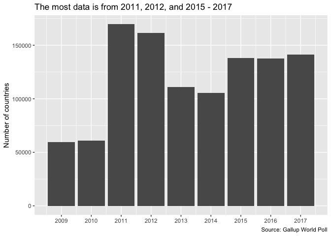<!-- -->

``` r
women_respect %>% 
  distinct(country, year) %>% 
  count(country) %>% 
  ggplot(aes(n)) +
  geom_bar() +
  scale_x_continuous(breaks = scales::breaks_width(1)) +
  labs(
    title = "Most countries have 7 years of data",
    x = "Number of data points",
    y = "Number of countries",
    caption = "Source: Gallup World Poll"
  )
```

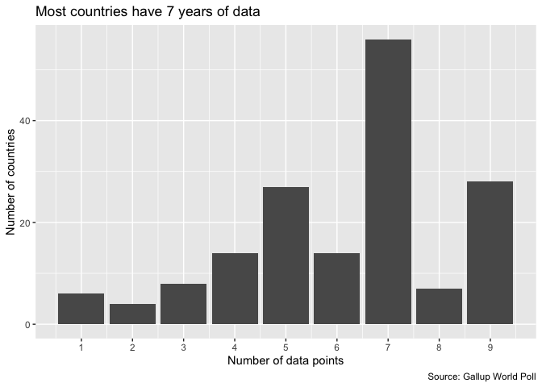<!-- -->

There is at least 5 years of data for 132 of the 164 countries (80%).

### Distribution of age

``` r
women_respect %>% 
  filter(year == 2017) %>% 
  ggplot(aes(age, weight = weight, fill = women_respected)) +
  geom_histogram(binwidth = 3, na.rm = TRUE, position = "dodge") +
  scale_x_continuous(breaks = scales::breaks_width(10)) +
  theme(legend.position = "bottom") +
  labs(
    title = "The poll represents more younger peoples' views",
    subtitle = 
      "Higher percentages of younger people believe women aren't respected in 2017",
    x = "Age",
    y = "Number of people",
    fill = "Are women respected\nin your country?",
    caption = "Source: Gallup World Poll"
  )
```

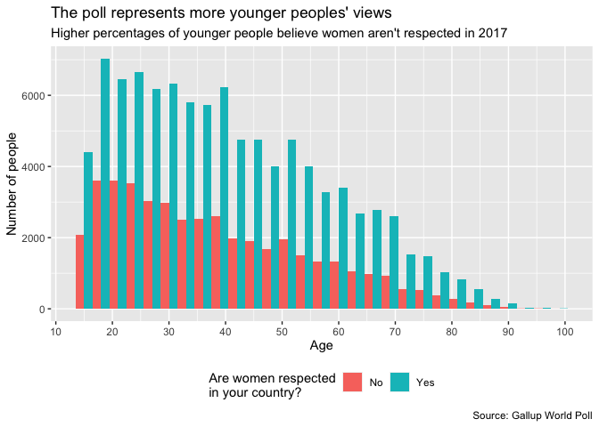<!-- -->

### Distribution of gender

``` r
women_respect %>% 
  filter(year == 2017) %>% 
  ggplot(aes(gender, weight = weight, fill = women_respected)) +
  geom_bar() +
  labs(
    title = "More men than women think women are respected",
    subtitle = "More men are represented in the poll in 2017",
    x = "Age",
    y = "Number of people",
    fill = "Are women respected\nin your country?",
    caption = "Source: Gallup World Poll"
  )
```

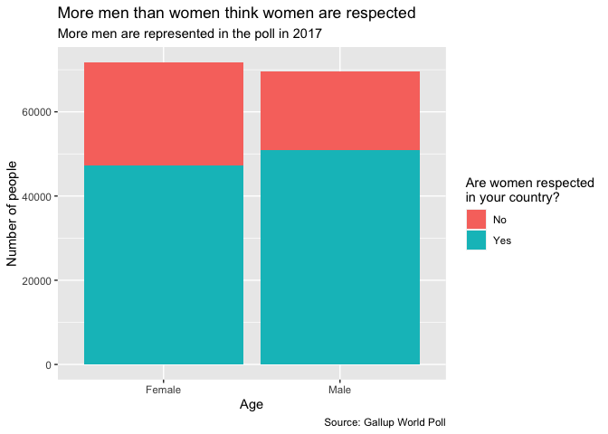<!-- -->

### Distribution of marital status

``` r
women_respect %>% 
  filter(year == 2017, !marital_status %in% c("(DK)", "(Refused)")) %>% 
  ggplot(aes(marital_status, weight = weight, fill = women_respected)) +
  geom_bar(position = "dodge") +
  coord_flip() +
  labs(
    title = 
      "Single, separated, or people in domestic partnerships are\nmore likely to think women are not respected",
    subtitle = "Most people surveyed in 2017 are married",
    x = "Marital status",
    y = "Number of people",
        fill = "Are women respected\nin your country?",
    caption = "Source: Gallup World Poll"
  )
```

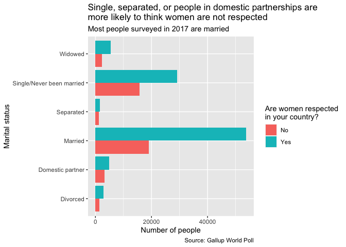<!-- -->

## Breakdown by years, genders, and regions

### By year, worldwide median respect of women

Breaking up the data into proportions of overall respect and proportions
of respect by gender.

``` r
women_respect_prop_gender <- 
  women_respect_all %>% 
  drop_na(women_respected_1, gender) %>% 
  count(
    country, 
    year, 
    region,
    region_2,
    gender,
    women_respected_1, 
    wt = weight, 
    name = "prop_respect"
  ) %>% 
  group_by(country, year, gender) %>% 
  mutate(prop_respect = prop_respect / sum(prop_respect)) %>%
  ungroup() %>% 
  filter(women_respected_1 == "Yes") %>% 
  pivot_wider(names_from = gender, values_from = prop_respect) %>% 
  select(-women_respected_1)

women_respect_props <- 
  women_respect_all %>% 
  drop_na(women_respected_1) %>% 
  count(
    country, 
    year, 
    region,
    region_2,
    women_respected_1,
    wt = weight, 
    name = "prop_respect"
  ) %>% 
  group_by(country, year) %>% 
  mutate(All = prop_respect / sum(prop_respect)) %>%
  ungroup() %>% 
  filter(women_respected_1 == "Yes") %>% 
  left_join(
    women_respect_prop_gender, by = c("country", "year", "region", "region_2")
  ) %>% 
  pivot_longer(
    cols = c(All, Female, Male), 
    names_to = "prop_type", values_to = "prop"
  ) %>% 
  select(-women_respected_1)
```

``` r
women_respect_props %>% 
  group_by(year) %>% 
  filter(prop_type == "All") %>% 
  ggplot(aes(year, prop)) +
  geom_boxplot(aes(group = year), varwidth = TRUE) +
  scale_x_continuous(breaks = scales::breaks_width(1)) +
  scale_y_continuous(labels = scales::percent_format(accuracy = 1)) +
  labs(
    title = "On average 60 - 70% of men and women think women are respected",
    x = NULL,
    y = "Percentage believing women are respected",
    caption = "Source: Gallup World Poll"
  )
```

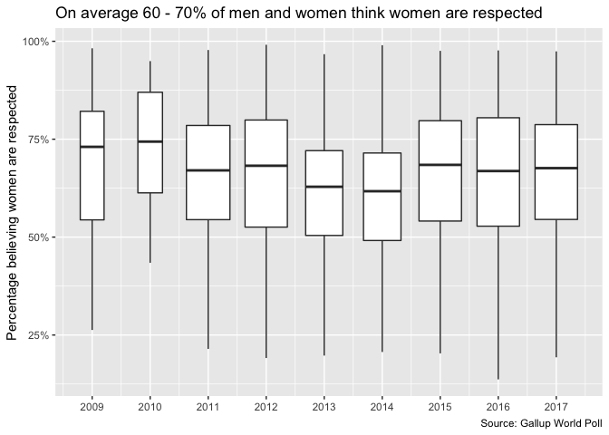<!-- -->

``` r
women_respect_props %>% 
  filter(prop_type != "All") %>% 
  ggplot(aes(factor(1), prop, color = prop_type)) +
  geom_boxplot(varwidth = TRUE) +
  facet_grid(cols = vars(year)) +
  scale_x_discrete(breaks = NULL) +
  scale_y_continuous(labels = scales::percent_format(accuracy = 1)) +
  scale_color_manual(values = c("Female" = "deep pink", "Male" = "blue")) +
  theme(legend.position = "bottom") +
  labs(
    title = "Men believe women are more respected than women do",
    x = NULL,
    y = "Percentage believing women are respected",
    color = NULL,
    caption = "Source: Gallup World Poll"
  )
```

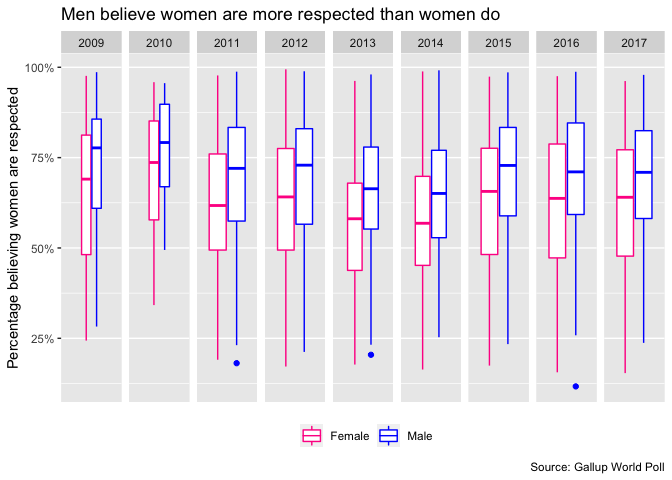<!-- -->

Opinions on whether women are respected vary significantly by gender.
with men thinking that women are more respected than women do.

### By country, are women respected in your country?

``` r
plot_country <- function(single_country) {
  women_respect_props %>% 
    filter(country == single_country) %>% 
    ggplot(aes(year, prop, color = prop_type)) +
    geom_point() +
    geom_line() +
    scale_x_continuous(breaks = scales::breaks_width(2)) +
    scale_y_continuous(labels = scales::percent_format(accuracy = 1)) +
    scale_color_manual(
      values = c("All" = "black", "Female" = "deep pink", "Male" = "blue")
    ) +
    theme(legend.position = "bottom") +
    labs(
      title = str_c("Are women respected in ", single_country, "?"), 
      x = "Year", 
      y = 'Percentage responding "Yes"',
      color = "Gender",
      caption = "Source: Gallup World Poll"
    )
}
```

``` r
plot_country("United States")
```

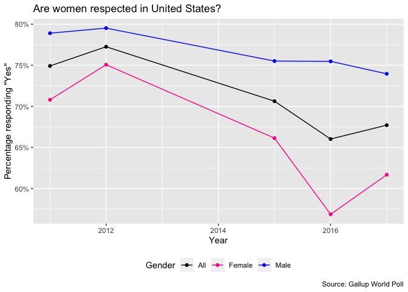<!-- -->

``` r
plot_country("Saudi Arabia")
```

<!-- -->

``` r
plot_country("United Arab Emirates")
```

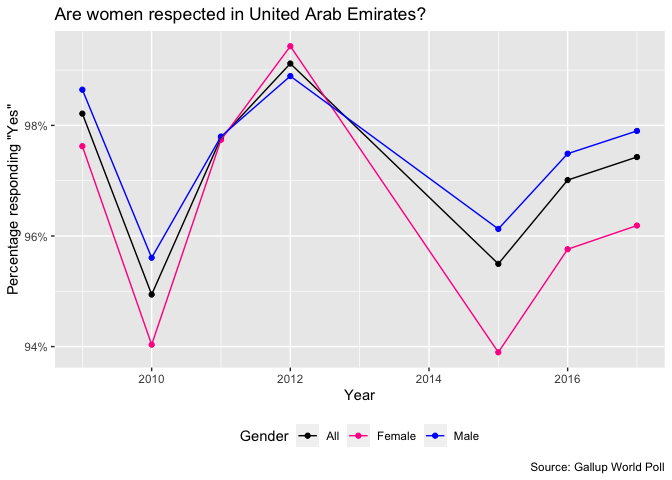<!-- -->

``` r
plot_country("Brazil")
```

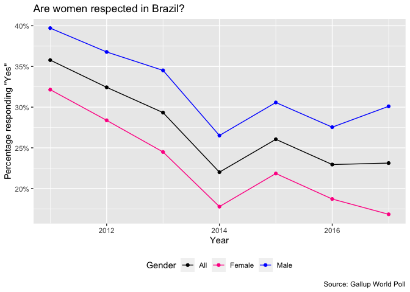<!-- -->

Some interesting country trends to note:

  - In the United States, women felt significantly less respected in
    2016 (when Trump was elected), but men thought women were more
    respected (since Hillary Clinton was running for president).
  - Perceived female respect is higher in Middle Eastern countries such
    as Saudi Arabia and the United Arab Emirates than in South American
    countries such as Brazil.
      - This could be due to experiences within cultural norms.
  - In countries in general, women always feel less respected than men
    think they are.

### By region, are women respected in your country?

``` r
women_respect_props %>% 
  group_by(region_2, year, prop_type) %>% 
  mutate(prop = mean(prop)) %>% 
  ungroup() %>% 
  ggplot(aes(year, prop, color = prop_type)) +
  geom_line() +
  facet_wrap(vars(region_2), ncol = 3) +
  scale_x_continuous(breaks = scales::breaks_width(2)) +
  scale_y_continuous(labels = scales::percent_format(accuracy = 1)) +
  scale_color_manual(
    values = c("All" = "black", "Female" = "deep pink", "Male" = "blue")
  ) +
  theme(legend.position = "bottom") +
  labs(
    title = "Are women respected in your country?", 
    x = NULL, 
    y = 'Percentage responding "Yes"',
    color = "Gender",
    caption = "Source: Gallup World Poll"
  )
```

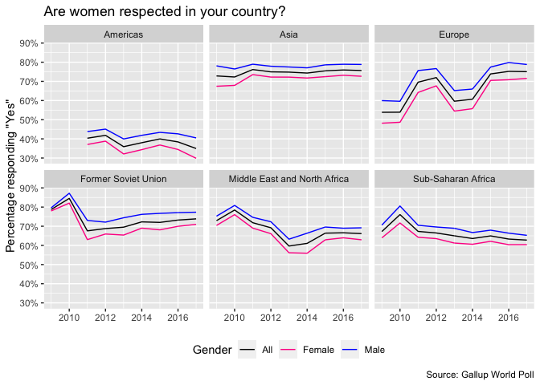

``` r
women_respect_props %>% 
  group_by(region, year, prop_type) %>% 
  mutate(prop = mean(prop)) %>% 
  ungroup() %>% 
  ggplot(aes(year, prop, color = prop_type)) +
  geom_line() +
  facet_wrap(vars(region), ncol = 3) +
  scale_x_continuous(breaks = scales::breaks_width(2)) +
  scale_y_continuous(labels = scales::percent_format(accuracy = 1)) +
  scale_color_manual(
    values = c("All" = "black", "Female" = "deep pink", "Male" = "blue")
    ) +
  theme(legend.position = "bottom") +
  labs(
    title = "Are women respected in your country?", 
    x = NULL, 
    y = 'Percentage responding "Yes"',
    color = "Gender",
    caption = "Source: Gallup World Poll"
  )
```

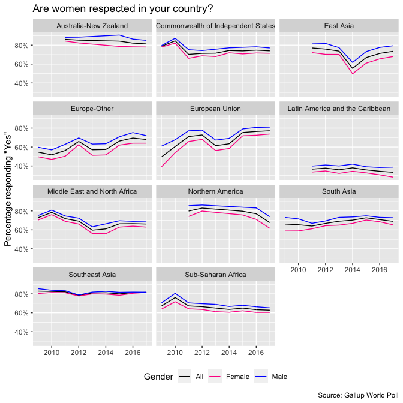

Opinions across genders are most clearly aligned in Southeast Asia and
significantly the lowest in Latin America and the Caribbean.

``` r
women_respect_props %>% 
  filter(prop_type == "All") %>% 
  group_by(region, year) %>% 
  summarize(prop = mean(prop)) %>% 
  ungroup() %>% 
  ggplot(aes(year, prop, color = region)) +
  geom_line() +
  ggrepel::geom_text_repel(
    data = . %>% filter(year == 2017), 
    aes(label = region), 
    size = 2, 
    nudge_x = 1, 
    point.padding = 0.25
  ) +
  scale_x_continuous(breaks = seq(2009, 2017, 2), limits = c(2009, 2018)) +
  scale_y_continuous(labels = scales::percent_format(accuracy = 1)) +
  theme(legend.position = "none") +
  labs(
    title = "Are women respected in your country?", 
    x = NULL, 
    y = 'Percentage responding "Yes"',
    color = "Gender",
    caption = "Source: Gallup World Poll"
  )
```

    ## `summarise()` has grouped output by 'region'. You can override using the `.groups` argument.

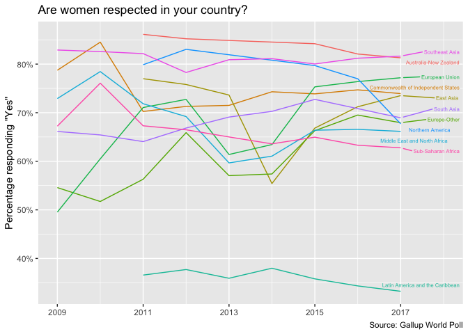

In general, perceived female respect varies greatly by region. The Latin
America and Caribbean has the lowest respect percentages by far, around
35% in 2017, with Sub-Saharan being a little less than double at 65% in
2017. Southeast Asia and the Australia-New Zealand regions have the
highest percentages of female respect, around 85%. Overall, female
respect worldwide has been declining since at least 2015.

## References

\[1\] [Methodology: How does the Gallup World Poll
Work?](https://www.gallup.com/178667/gallup-world-poll-work.aspx)

\[2\] Gallup World Poll. [“Do you believe that women in this country are
treated with respect and dignity, or
not?”](https://wpr.gallup.com/home.aspx?ref=logo)
