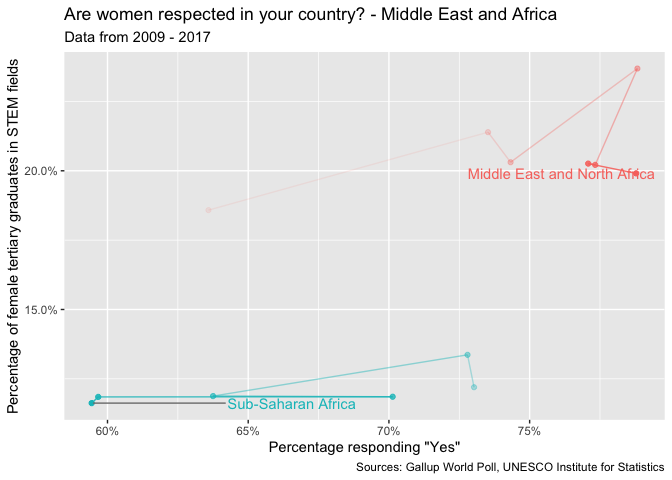

Female respect and female STEM tertiary graduates
================
Sara Berg-Love
2020-03-14

  - [Summary](#summary)
  - [1D analysis](#1d-analysis)
  - [Correlation between respect of women and female STEM tertiary
    grads](#correlation-between-respect-of-women-and-female-stem-tertiary-grads)
      - [Overall](#overall)
      - [Regional](#regional)
      - [National](#national)
  - [Conclusions](#conclusions)
  - [References](#references)

``` r
# Libraries
library(tidyverse)

# Parameters
file_data <- here::here("data/women_respect_stem_grad.rds")

#===============================================================================

women_respect_stem_grad <- read_rds(file_data)
```

Using UNESCO Institute of Statistics data on female tertiary STEM field
graduates and Gallup World Poll data on whether people think women are
respected, this will explore if there is a correlation between the two
in countries worldwide \[1\]\[2\].

## Summary

``` r
women_respect_stem_grad %>% 
  summary()
```

    ##    country               year      perct_women_stem_grad    region         
    ##  Length:3815        Min.   :1998   Min.   : 0.5714       Length:3815       
    ##  Class :character   1st Qu.:2011   1st Qu.: 9.5287       Class :character  
    ##  Mode  :character   Median :2013   Median :12.7126       Mode  :character  
    ##                     Mean   :2012   Mean   :13.3725                         
    ##                     3rd Qu.:2015   3rd Qu.:15.7931                         
    ##                     Max.   :2019   Max.   :60.0000                         
    ##                                    NA's   :1956                            
    ##    region_2          prop_type              prop       
    ##  Length:3815        Length:3815        Min.   :0.1169  
    ##  Class :character   Class :character   1st Qu.:0.5231  
    ##  Mode  :character   Mode  :character   Median :0.6715  
    ##                                        Mean   :0.6513  
    ##                                        3rd Qu.:0.7963  
    ##                                        Max.   :0.9943  
    ##                                        NA's   :776

``` r
women_respect_stem_grad <- 
  women_respect_stem_grad %>% 
  drop_na(perct_women_stem_grad, prop)
```

## 1D analysis

``` r
women_respect_stem_grad %>% 
  distinct(country, year) %>% 
  ggplot(aes(year)) +
  geom_bar() +
  scale_x_continuous(breaks = scales::breaks_width(1)) +
  labs(
    title = "The most data is from 2015 - 2017",
    x = NULL,
    y = "Number of countries",
    caption = "Sources: Gallup World Poll, UNESCO Institute for Statistics"
  )
```

<!-- -->

``` r
women_respect_stem_grad %>% 
  distinct(country, year) %>% 
  count(country) %>% 
  ggplot(aes(n)) +
  geom_histogram(binwidth = 1) +
  scale_x_continuous(breaks = scales::breaks_width(1)) +
  labs(
    title = "Most countries have 3 years of data",
    x = "Number of data points",
    y = "Number of countries",
    caption = "Sources: Gallup World Poll, UNESCO Institute for Statistics"
  )
```

<!-- -->

``` r
women_respect_stem_grad %>% 
  filter(year %in% c(2015, 2016, 2017)) %>% 
  select(country, year) %>% 
  distinct(country, year) %>% 
  count(country) %>% 
  arrange(desc(n))
```

    ## # A tibble: 90 x 2
    ##    country                    n
    ##    <chr>                  <int>
    ##  1 Albania                    3
    ##  2 Armenia                    3
    ##  3 Azerbaijan                 3
    ##  4 Bahrain                    3
    ##  5 Belarus                    3
    ##  6 Belgium                    3
    ##  7 Bosnia and Herzegovina     3
    ##  8 Brazil                     3
    ##  9 Bulgaria                   3
    ## 10 Burkina Faso               3
    ## # … with 80 more rows

The years 2015-2017 have the most data available to interpret. There are
10 countries with 7 years of data - Azerbaijan, Bulgaria, Estonia,
Hungary, Kyrgyzstan, Latvia, Lithuania, Poland, Saudi Arabia, and
Serbia. However, if we look at 2015 to 2017, there are 43 countries with
all 3 years of that data and 91 with at least 1.

## Correlation between respect of women and female STEM tertiary grads

### Overall

``` r
plot_respect_stem_correlation <- function(type) {
  women_respect_stem_grad %>% 
    filter(year %in% c(2009, 2011, 2013, 2015, 2017), prop_type == {{type}}) %>% 
    ggplot(aes(prop, perct_women_stem_grad, color = factor(year))) +
    geom_point(aes(alpha = 0.5), show.legend = FALSE) +
    geom_smooth(se = FALSE) +
    scale_x_continuous(
      labels = scales::percent_format(accuracy = 1), 
      breaks = scales::breaks_width(0.1)
    ) +
    scale_y_continuous(
      labels = scales::percent_format(accuracy = 1, scale = 1)
    ) +
    coord_fixed(ratio = 0.01) +
    guides(color = guide_legend(reverse = TRUE)) +
    labs(
      title = 
          "No real correlation between higher female respect and STEM graduates",
      subtitle = str_c({{type}}, " data for 2016"),
      x = 'Percentage believing women are respected in their country',
      y = "Percentage of female tertiary graduates in STEM fields",
      color = "Year",
      caption = "Sources: Gallup World Poll, UNESCO Institute for Statistics"
    )
}

plot_respect_stem_correlation("All")
```


``` r
plot_respect_stem_correlation("Female")
```


``` r
plot_respect_stem_correlation("Male")
```


There is no real correlation between female respect and tertiary
graduation rates from STEM fields. This goes for the aggregate
percentage of respect for women in addition to the percentages of female
respect broken down by gender. Unfortunately, there has not been an
overall increase over time in either percentage of female tertiary STEM
graduates or percentage of females respected.

### Regional

``` r
women_respect_stem_grad %>% 
  filter(country == "United States of America", prop_type == "All") %>% 
  arrange(country, year) %>% 
  ggplot(aes(prop, perct_women_stem_grad)) +
  geom_point(aes(alpha = year), show.legend = FALSE) +
  geom_path(aes(alpha = year), show.legend = FALSE) +
  ggrepel::geom_text_repel(
    aes(label = year), 
    nudge_y = -0.02, 
    size = 3,
    show.legend = FALSE
  ) +
  scale_x_continuous(
    labels = scales::percent_format(accuracy = 1), 
    breaks = scales::breaks_width(0.02)
  ) +
  scale_y_continuous(
    labels = scales::percent_format(accuracy = 1, scale = 1),
    breaks = scales::breaks_width(2),
    limits = c(1, 12)
  ) +
  coord_fixed(ratio = 0.01) +
  theme(legend.position = "bottom") +
  labs(
    title = 
      "Respect for women in the US is decreasing but\npercentage of female STEM graduates is increasing",
    x = 'Percentage of perceived female respect',
    y = "Percentage of female tertiary graduates in STEM fields",
    caption = "Sources: Gallup World Poll, UNESCO Institute for Statistics"
  )
```


Percentage of female STEM tertiary graduates is slowly increasing in the
United States, but the percentage of female respect has decreased since
2012. This is not a good trend, especially as across the country there
have been increasing amounts of financial support and programs for girls
in STEM and this only shows a small increase.

``` r
plot_regions <- function(region_type, prop_respect_type){
  women_respect_stem_grad %>% 
    filter(prop_type == {{prop_respect_type}}) %>% 
    group_by({{region_type}}, year) %>% 
    summarize(
      perct_women_stem_grad = mean(perct_women_stem_grad), 
      prop = mean(prop)
    ) %>% 
    arrange({{region_type}}, year) %>% 
    ggplot(aes(prop, perct_women_stem_grad, color = {{region_type}})) +
    geom_path(aes(alpha = year), show.legend = FALSE) +
    geom_point(data = . %>% filter(year == max(year)), show.legend = FALSE) +
    ggrepel::geom_text_repel(
      aes(label = {{region_type}}), 
      data = . %>% filter(year == max(year)), 
      nudge_y = 0.01, 
      hjust = 0,
      show.legend = FALSE, 
      color = "black",
      segment.color = "gray50",
      size = 2.5
    ) +
    scale_x_continuous(
      labels = scales::percent_format(accuracy = 1), 
      breaks = scales::breaks_width(0.05)) +
    scale_y_continuous(
      labels = scales::percent_format(accuracy = 1, scale = 1),
    ) +
    theme(legend.position = "bottom") +
    labs(
      title = "Are women respected in your country?", 
      subtitle = str_c({{prop_respect_type}}, " data from 2009 - 2017"),
      x = 'Percentage of perceived female respect',
      y = "Percentage of female tertiary graduates in STEM fields",
      caption = "Sources: Gallup World Poll, UNESCO Institute for Statistics"
    )
}
```

``` r
plot_regions(region, "All")
```

    ## `summarise()` has grouped output by 'region'. You can override using the `.groups` argument.


``` r
plot_regions(region_2, "All")
```

    ## `summarise()` has grouped output by 'region_2'. You can override using the `.groups` argument.


``` r
plot_regions(region_2, "Female")
```

    ## `summarise()` has grouped output by 'region_2'. You can override using the `.groups` argument.


``` r
plot_regions(region_2, "Male")
```

    ## `summarise()` has grouped output by 'region_2'. You can override using the `.groups` argument.


There is not really a difference between female and male perceived
female respect regionally on female tertiary STEM graduates except that
females consistently think female respect percentages are lower.

For the aggregate data, the Middle East and North Africa region is one
outlier, with surprisingly high female respect for what seems like to
the rest of the world a very conservative culture for women. However, it
seems that the respect is even improving. They also have relatively high
female tertiary graduate in STEM fields presentages. On the other end,
Latin America and the Caribbean have both the lowest respect and
percentage of female STEM graduates. While female STEM graduate
percentages there seem to be increasing, respect of women is
unfortunately decreasing overall.

``` r
plot_region_breakdown <- function(regions, region_name) {
  women_respect_stem_grad %>% 
    filter(prop_type == "All") %>% 
    group_by(region, year) %>% 
    summarize(
      perct_women_stem_grad = mean(perct_women_stem_grad), 
      prop = mean(prop)
    ) %>% 
    filter(region %in% regions) %>% 
    arrange(region, year) %>% 
    ggplot(aes(prop, perct_women_stem_grad, color = region)) +
    geom_path(aes(alpha = year), show.legend = FALSE) +
    geom_point(aes(alpha = year), show.legend = FALSE) +
    ggrepel::geom_text_repel(
      aes(label = region), 
      data = . %>% filter(year == max(year)), 
      nudge_x = 0.05, 
      hjust = 0,
      show.legend = FALSE,
      segment.color = "gray50"
    ) +
    scale_x_continuous(labels = scales::percent_format(accuracy = 1)) +
    scale_y_continuous(
      labels = scales::percent_format(accuracy = 0.1, scale = 1)
    ) +
    theme(legend.position = "bottom") +
    labs(
      title = str_c("Are women respected in your country? - ", region_name),
      subtitle = "Data from 2009 - 2017",
      x = 'Percentage responding "Yes"',
      y = "Percentage of female tertiary graduates in STEM fields",
      caption = "Sources: Gallup World Poll, UNESCO Institute for Statistics"
    )
}
```

``` r
plot_region_breakdown(
  c("Northern America", "Latin America and the Caribbean"), "Americas"
)
```

    ## `summarise()` has grouped output by 'region'. You can override using the `.groups` argument.


``` r
plot_region_breakdown(
  c("East Asia", "South Asia", "Southeast Asia"), "Asia"
)
```

    ## `summarise()` has grouped output by 'region'. You can override using the `.groups` argument.


``` r
plot_region_breakdown(
  c("Sub-Saharan Africa", "Middle East and North Africa"), 
  "Middle East and Africa"
)
```

    ## `summarise()` has grouped output by 'region'. You can override using the `.groups` argument.



``` r
plot_region_breakdown(
  c("European Union", "Europe - Other", "Commonwealth of Independent States"), 
  "Europe"
)
```

    ## `summarise()` has grouped output by 'region'. You can override using the `.groups` argument.


There does not seem to be a strong correlation when breaking down the
regions into sub-regions. It is apparent that Sub-Saharan Africa is much
lower for percentages of respect and STEM graduates than the Middle East
and North Africa and that Latin America and the Caribbean is also much
lower for both than North America though.

### National

``` r
plot_regional_countries <- function(single_region) {
  women_respect_stem_grad %>% 
    filter(region == single_region, prop_type == "All") %>% 
    group_by(country, year) %>% 
    summarize(
      perct_women_stem_grad = mean(perct_women_stem_grad), 
      prop = mean(prop)
    ) %>% 
    arrange(country, year) %>% 
    ggplot(aes(prop, perct_women_stem_grad, color = country)) +
    geom_path(aes(alpha = year), show.legend = FALSE) +
    geom_point(aes(alpha = year), show.legend = FALSE) +
    ggrepel::geom_text_repel(
      aes(label = country), 
      data = . %>% filter(year == max(year)), 
      nudge_x = -0.01, 
      hjust = 0,
      size = 3,
      show.legend = FALSE, 
      segment.color = "gray50"
    ) +
    scale_x_continuous(labels = scales::percent_format(accuracy = 1)) +
    scale_y_continuous(
      labels = scales::percent_format(accuracy = 1, scale = 1)
    ) +
    theme(legend.position = "bottom") +
    labs(
      title = str_c("Are women respected in your country? - ", single_region), 
      subtitle = "Data from 2009 - 2017",
      x = 'Percentage responding "Yes"',
      y = "Percentage of female tertiary graduates in STEM fields",
      caption = "Sources: Gallup World Poll, UNESCO Institute for Statistics"
    ) 
}
```

``` r
plot_regional_countries("Middle East and North Africa")
```

    ## `summarise()` has grouped output by 'country'. You can override using the `.groups` argument.


``` r
plot_regional_countries("Latin America and the Caribbean")
```

    ## `summarise()` has grouped output by 'country'. You can override using the `.groups` argument.


``` r
plot_regional_countries("Northern America")
```

    ## `summarise()` has grouped output by 'country'. You can override using the `.groups` argument.


For the Middle East and North Africa region, Tunisia and Turkey are both
outliers. Tunisia potentially has the highest female STEM graduate
percentage due to its pro-democracy shift in the Arab Spring leading to
political and economic reforms. Turkey might have the lowest female
respect and a fairly low percentage of female STEM graduates because of
the role women are expected to play in society \[3\]. Only 34% of women
work outside the home in Turkey and are expected to focus solely on
being homemakers.

For the Latin America and Caribbean region, Peru is the main outlier. It
has the highest female STEM graduate percentage, but female respect has
been decreasing to less than 25%. The increasing STEM graduate
percentage could be correlated with its increasing GDP and decreasing
overall poverty, which is one of the highest in the region \[4\].

## Conclusions

Overall, there does not appear to be much of a correlation between
increasing female respect in a country, from a male or female
perspective, leading to an increased percentage of female STEM tertiary
graduates. However, there are still certain countries that are doing
better with respecting women and supporting them going into STEM fields
and some that have downward trends as well. This could be useful in the
future in knowing where to look for policies that do or do not work in
supporting women.

## References

\[1\] [UNESCO Institute for Statistics.](http://data.uis.unesco.org/)

\[2\] Gallup World Poll. [“Do you believe that women in this country are
treated with respect and dignity, or
not?”](https://wpr.gallup.com/home.aspx?ref=logo)

\[3\] Lowen, Mark. BBC News. March 1, 2018. [Women challenge Turkey
traditions for right to
work.](https://www.bbc.com/news/world-europe-43197642)

\[4\] The World Bank. October 1, 2011. [Data by country:
Peru.](https://data.worldbank.org/country/peru)
