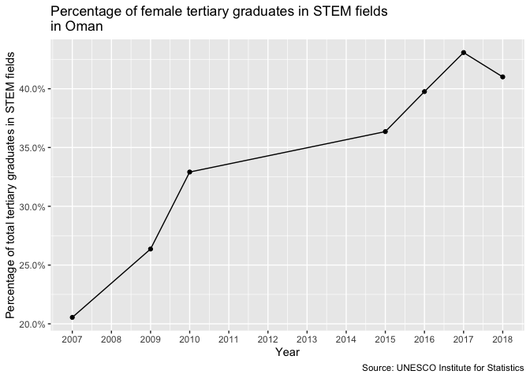

Female STEM tertiary graduates
================
Sara Berg-Love
2020-03-14

  - [Summary](#summary)
  - [1D data analysis](#1d-data-analysis)
  - [Percentage worldwide over time](#percentage-worldwide-over-time)
  - [Female graduates in STEM fields by
    country](#female-graduates-in-stem-fields-by-country)
  - [Female graduate percentages most and least
    improved](#female-graduate-percentages-most-and-least-improved)
  - [References](#references)

``` r
# Libraries
library(tidyverse)

# Parameters
file_data <- here::here("data/women_stem_grad.rds")

#===============================================================================

women_stem_grad <- read_rds(file_data)
```

The UNESCO Institute for Statistics (IUS) has a global database to
monitor progress on some of their Sustainable Development Goals, such as
number 4: equality in education, number 5: gender equality, and number
9: increasing innovation \[1\]\[2\].

## Summary

``` r
women_stem_grad %>% 
  summary()
```

    ##    country               year      perct_women_stem_grad
    ##  Length:1137        Min.   :1998   Min.   : 0.5714      
    ##  Class :character   1st Qu.:2004   1st Qu.: 8.8226      
    ##  Mode  :character   Median :2010   Median :12.4345      
    ##                     Mean   :2009   Mean   :13.0432      
    ##                     3rd Qu.:2015   3rd Qu.:15.6218      
    ##                     Max.   :2019   Max.   :60.0000

## 1D data analysis

``` r
women_stem_grad %>% 
  top_n(10, perct_women_stem_grad) %>% 
  arrange(desc(perct_women_stem_grad))
```

    ## # A tibble: 10 x 3
    ##    country        year perct_women_stem_grad
    ##    <chr>         <int>                 <dbl>
    ##  1 Liechtenstein  2003                  60  
    ##  2 Gambia         2011                  53.1
    ##  3 Oman           2017                  43.1
    ##  4 Samoa          1998                  42.4
    ##  5 Oman           2018                  41.0
    ##  6 Liberia        2000                  40.2
    ##  7 Oman           2016                  39.8
    ##  8 Tunisia        2015                  37.2
    ##  9 Tunisia        2016                  37.2
    ## 10 Tunisia        2018                  36.5

``` r
women_stem_grad %>% 
  ggplot(aes(year)) +
  geom_bar() +
  scale_x_continuous(breaks = scales::breaks_width(2)) +
  labs(
    title = "The most data is for the years 2015 - 2017",
    x = NULL,
    y = "Number of data points",
    caption = "Source: UNESCO Institute for Statistics"
  )
```

<!-- -->

``` r
women_stem_grad %>% 
  count(country) %>% 
  ggplot(aes(n)) +
  geom_bar() +
  scale_x_continuous(breaks = scales::breaks_width(1)) +
  labs(
    title = "Most countries only have 1 data point", 
    x = "Number of data points", 
    y = "Number of countries",
    caption = "Source: UNESCO Institute for Statistics"
  )
```

<!-- -->

``` r
women_stem_grad %>% 
  filter(year == 2017) %>% 
  group_by(country) %>% 
  summarize(perct_women_stem_grad_avg = median(perct_women_stem_grad)) %>% 
  ggplot(aes(perct_women_stem_grad_avg)) +
  geom_histogram(binwidth = 2) +
  geom_vline(
    aes(xintercept = median(perct_women_stem_grad_avg)), color = "blue"
  ) +
  scale_x_continuous(
    breaks = scales::breaks_width(5), 
    labels = scales::percent_format(accuracy = 1, scale = 1)
  ) +
  labs(
    title = 
      "Worldwide the average female STEM tertiary graduates was only 12.5% in 2017",
    x = "Percentage of female STEM graduates",
    y = "Number of data points",
    caption = "Source: UNESCO Institute for Statistics"
  )
```

<!-- -->

The most data is for the years 2015 - 2017, but most countries only have
1 data point. It is interesting that Liechtenstein, Gambia, and Myanmar
have some of the highest percentages of female tertiary graduates in
STEM fields, although it only ranges from 0.6% to 60%. The worldwide
average female STEM graduate percentage is very low, only 12.5%.

## Percentage worldwide over time

``` r
women_stem_grad %>% 
  ggplot(aes(year, perct_women_stem_grad)) +
  geom_boxplot(aes(group = year), varwidth = TRUE) +
  ggrepel::geom_text_repel(data = . %>% filter(perct_women_stem_grad > 40), aes(label = country), size = 3) +
  labs(
    title = "Median female STEM graduates has not increased over time",
    subtitle = "Although there are increasing numbers of high outliers",
    x = NULL,
    y = "Percentage of female tertiary graduates in STEM fields"
  )
```

<!-- -->

Worldwide, the median percentage of female STEM graduates has not
increased since 1999. 1998 has a slightly higher percentage, but that
could be due to significantly fewer data points. However, there are
increasing numbers of outliers on the higher percentage end, which could
be a good sign that the female percentage of STEM graduates might
increase in the future. There was a slight increase from 2017 to 2018
and not enough data yet for 2019 to make any conclusions.

## Female graduates in STEM fields by country

``` r
women_stem_grad %>% 
  group_by(country) %>% 
  filter(length(country) >= 2) %>%
  ungroup() %>% 
  ggplot(aes(year, perct_women_stem_grad)) +
  geom_point(size = 1) +
  geom_line() +
  facet_wrap(vars(country), ncol = 4) +
  scale_y_continuous(labels = scales::percent_format(accuracy = 1, scale = 1)) +
  labs(
    title = "Percentage of female tertiary graduates in STEM fields",
    x = "Year",
    y = "Percentage of total tertiary graduates in STEM fields",
    caption = "Source: UNESCO Institute for Statistics"
  )
```


``` r
women_stem_grad %>%
  group_by(country) %>% 
  filter(length(country) >= 2) %>%
  ungroup() %>% 
  ggplot(aes(year, perct_women_stem_grad, color = country)) +
  geom_point() +
  geom_line() +
  ggrepel::geom_text_repel(
    aes(label = country), 
    data = . %>% group_by(year) %>% filter(perct_women_stem_grad > 40), 
    nudge_y = 2, 
    size = 3
  ) +
  scale_y_continuous(labels = scales::percent_format(accuracy = 1, scale = 1)) +
  theme(legend.position = "none") +
  labs(
    title = 
      "Few countries have female STEM tertiary graduate percentages above 40%",
    x = "Year",
    y = "Percentage of female tertiary graduates in STEM fields",
    caption = "Source: UNESCO Institute for Statistics"
  )
```


Top 5 countries in 1998 for percentage of female tertiary STEM
graduates:

``` r
women_stem_grad %>% 
  arrange(year) %>% 
  filter(year == first(year) + 2) %>% 
  top_n(5, perct_women_stem_grad) %>% 
  arrange(desc(perct_women_stem_grad)) %>% 
  knitr::kable()
```

| country           | year | perct\_women\_stem\_grad |
| :---------------- | ---: | -----------------------: |
| Liberia           | 2000 |                 40.22140 |
| Republic of Korea | 2000 |                 26.53618 |
| Ireland           | 2000 |                 23.74962 |
| Turkey            | 2000 |                 23.14826 |
| Qatar             | 2000 |                 21.30653 |

Bottom 5 countries in 1998 for percentage of female tertiary STEM
graduates:

``` r
women_stem_grad %>% 
  arrange(year) %>% 
  filter(year == first(year) + 2) %>% 
  top_n(-5, perct_women_stem_grad) %>% 
  arrange(perct_women_stem_grad) %>% 
  knitr::kable()
```

| country              | year | perct\_women\_stem\_grad |
| :------------------- | ---: | -----------------------: |
| Netherlands Antilles | 2000 |                  0.57143 |
| Albania              | 2000 |                  3.40694 |
| Ethiopia             | 2000 |                  3.88664 |
| Sierra Leone         | 2000 |                  4.21091 |
| Chad                 | 2000 |                  4.39560 |

Top 5 countries in 2018 for percentage of female tertiary STEM
graduates:

``` r
women_stem_grad %>% 
  arrange(year) %>% 
  filter(year == last(year) - 1) %>% 
  top_n(5, perct_women_stem_grad) %>% 
  arrange(desc(perct_women_stem_grad)) %>% 
  knitr::kable()
```

| country           | year | perct\_women\_stem\_grad |
| :---------------- | ---: | -----------------------: |
| Oman              | 2018 |                 41.00775 |
| Tunisia           | 2018 |                 36.46269 |
| Brunei Darussalam | 2018 |                 33.74094 |
| Myanmar           | 2018 |                 31.00917 |
| Algeria           | 2018 |                 30.89274 |

Bottom 5 countries in 2018 for percentage of female tertiary STEM
graduates:

``` r
women_stem_grad %>% 
  arrange(year) %>% 
  filter(year == last(year) - 1) %>% 
  top_n(-5, perct_women_stem_grad) %>% 
  arrange(perct_women_stem_grad) %>% 
  knitr::kable()
```

| country                                    | year | perct\_women\_stem\_grad |
| :----------------------------------------- | ---: | -----------------------: |
| China, Macao Special Administrative Region | 2018 |                  3.28891 |
| Mozambique                                 | 2018 |                  5.61639 |
| Niger                                      | 2018 |                  5.81764 |
| Lesotho                                    | 2018 |                  6.43981 |
| Seychelles                                 | 2018 |                  7.86885 |

``` r
plot_women_stem_grad_country <- function(country) {
  women_stem_grad %>% 
    filter(country == {{country}}) %>% 
    ggplot(aes(year, perct_women_stem_grad)) +
    geom_point() +
    geom_line() +
    scale_x_continuous(breaks = scales::breaks_width(width = 1)) +
    scale_y_continuous(
      labels = scales::percent_format(accuracy = 0.1, scale = 1)
    ) +
    labs(
      title = 
        str_glue(
          "Percentage of female tertiary graduates in STEM fields\nin ", 
          {{country}}
        ),
      x = "Year",
      y = "Percentage of total tertiary graduates in STEM fields",
      caption = "Source: UNESCO Institute for Statistics"
    )
}

plot_women_stem_grad_country("United States of America")
```

<!-- -->

``` r
plot_women_stem_grad_country("Liechtenstein")
```

<!-- -->

``` r
plot_women_stem_grad_country("Gambia")
```

<!-- -->

``` r
plot_women_stem_grad_country("Oman")
```

<!-- -->

``` r
plot_women_stem_grad_country("Samoa")
```

<!-- -->

Pulling out specific outliers and plotting them to see if there are
interesting trends, we see that the United States decreased its
percentage of female STEM graduates but since 2013 it has been
increasing again. Liechtenstein had a stark decrease by almost 50% from
2003 to 2004, which could be wrong data or an unfortunate trend.
However, since then it has mostly been increasing. Gambia has had about
a 50% increase over 7 years which is good and Oman has increased starkly
as well. Samoa has decreased more than 40% in 2 years from 1998 to 2000,
but it does not have any updated data since then, so hard to say if
that’s a general trend.

## Female graduate percentages most and least improved

``` r
women_stem_grad %>% 
  arrange(year) %>%
  group_by(country) %>%
  summarize(
    change =  
      (last(perct_women_stem_grad) - first(perct_women_stem_grad)) / 
      (last(year) - first(year))
  ) %>% 
  top_n(5, wt = change) %>% 
  arrange(desc(change)) %>% 
  knitr::kable()
```

| country        |    change |
| :------------- | --------: |
| Mauritania     | 12.610140 |
| Peru           | 10.446510 |
| Gambia         |  5.901910 |
| Sudan          |  5.012057 |
| Cayman Islands |  3.170290 |

``` r
women_stem_grad %>% 
  arrange(year) %>%
  group_by(country) %>%
  summarize(
    change =  
      (last(perct_women_stem_grad) - first(perct_women_stem_grad)) / 
      (last(year) - first(year))
  ) %>% 
  top_n(-5, wt = change) %>% 
  arrange(change) %>% 
  knitr::kable()
```

| country             |      change |
| :------------------ | ----------: |
| Samoa               | \-16.069265 |
| Antigua and Barbuda |  \-3.105797 |
| Liechtenstein       |  \-2.910798 |
| Dominican Republic  |  \-1.197545 |
| Uganda              |  \-1.022568 |

Gambia has increased its percentage of female STEM tertiary graduates by
about 41% by year, followed by Brunei Daussalam at 26% per year and Oman
at 20% per year. Samoa has decreased its percentage by 16% per year and
followed by Antigua and Barbuda and Liechtenstein at 3% per year which
are not good trends.

## References

\[1\] [UNESCO Institute for Statistics.](http://data.uis.unesco.org/)

\[2\] UNESCO Institute for Statistics. [Data for the Sustainable
Development Goals.](http://uis.unesco.org/)
